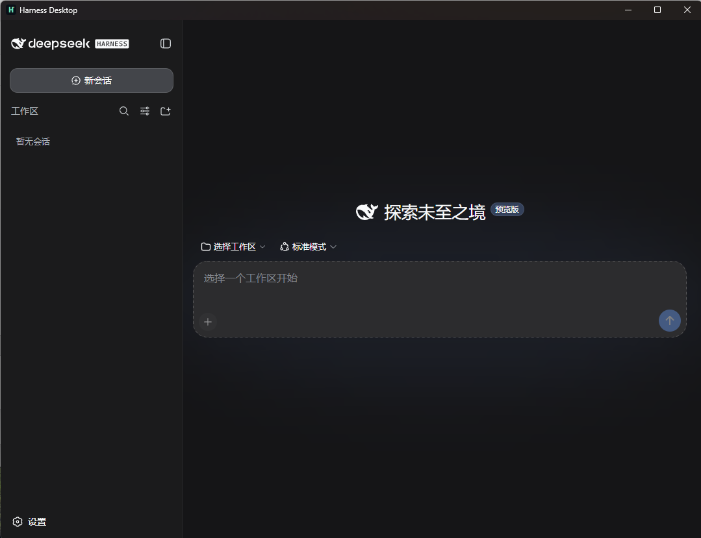
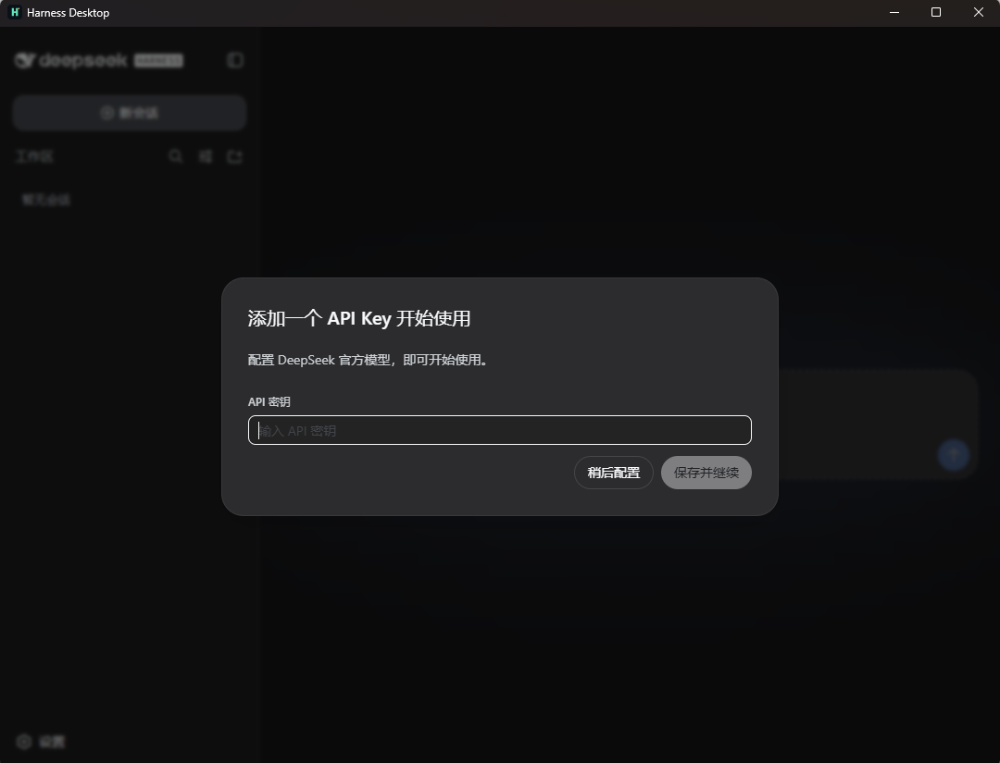
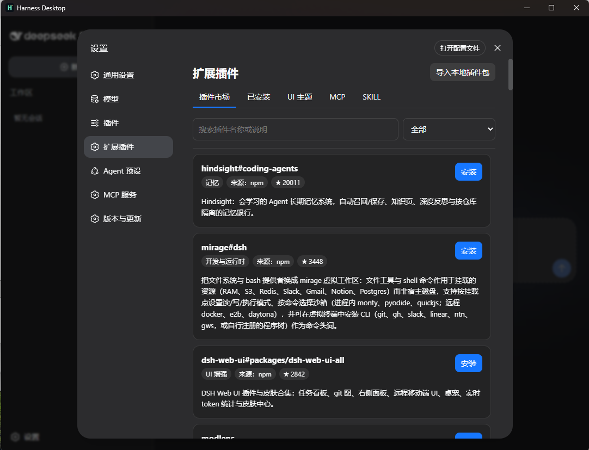
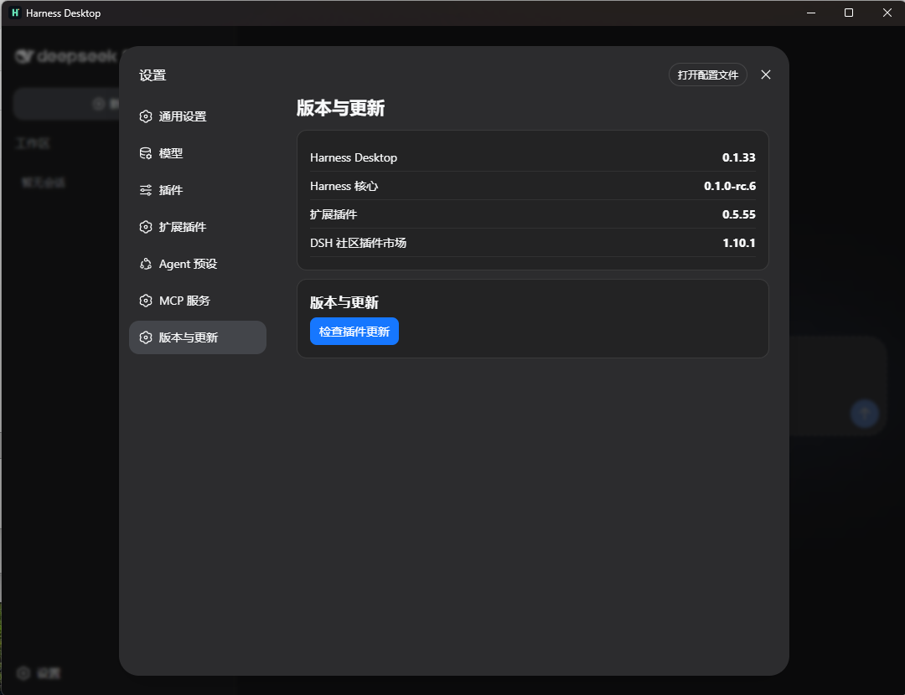

# Harness Desktop

面向中文用户的 [DeepSeek Harness](https://github.com/deepseek-ai/DeepSeek-Harness) 本地桌面工作台。它保留官方 Harness 的 Agent、CLI、SDK、插件和会话协议，只在外层提供开箱即用的 Windows 桌面体验。

> 社区项目，与 DeepSeek 官方无隶属关系。当前处于 Windows 公测准备阶段。

国内展示页与下载入口：[演示入口]([https://dhs.danmucore.top/])

## 主要功能

- **非侵入式封装**：不修改官方 Agent loop、工具协议或会话存储；其他工具仍可按官方支持范围使用 Harness 的 CLI、SDK、Headless 与 ACP 能力。
- **本地桌面体验**：内置 Runtime、自动创建默认工作区、关闭窗口最小化至托盘，退出菜单才会停止 Harness。
- **中文扩展插件**：中文权限映射、中文设置说明，以及插件市场中的中文名称、分类和说明。
- **插件市场**：集成 [dshmarket](https://github.com/dsh-market/dsh-market) 社区插件市场；Desktop 在其基础上提供中文说明、本地管理和受限网络兜底，支持搜索、安装、更新、卸载、启停、已安装/可更新筛选和已知 UI 冲突提示。
- **MCP、SKILL 与主题**：内置 MCP 服务配置器；支持本地导入插件/Skill 包，以及主题和 UI 插件的启停管理。
- **受限网络兜底**：市场目录有本地快照；npm 使用官方源与国内镜像回退；GitHub 资产可通过代理镜像下载。第三方插件自己的外部 API 不在 Desktop 控制范围内。
- **本地快照回滚**：对可能修改工作区的工具执行自动创建恢复点，不要求用户先学会 Git。
- **隐私优先**：会话、Key、工作区和诊断日志默认仅保存在本机，不上传到本项目服务器。

## 安装与使用

1. 在 [Releases](https://github.com/Cx330v/Harness-Desktop/releases) 下载最新 Windows x64 安装包。
2. 安装后直接打开 **Harness Desktop**；首次启动会创建一个仅供本机会话使用的默认工作区。
3. 在官方 Harness 工作台中选择真实项目目录、配置模型与 API Key，然后开始对话。

需要使用插件时，打开 Harness 的“设置 → 扩展插件”。插件名与介绍会优先显示中文；安装第三方插件前请自行判断其来源、权限与依赖的外部服务。

## 界面预览

### 工作台



### API Key 配置



### 扩展插件与中文插件市场



### 版本与更新



## 数据位置与排障

- 默认工作区：`%APPDATA%\com.local.harness-desktop\workspace`
- Harness 数据目录：`%APPDATA%\com.local.harness-desktop\harness-home`
- 启动日志：`%APPDATA%\com.local.harness-desktop\harness-runtime.log`

请勿在公开 Issue 中提交 API Key、会话内容或完整日志。安全问题请按 [SECURITY.md](SECURITY.md) 的方式私下报告。第三方组件的署名与来源见 [THIRD_PARTY_NOTICES.md](docs/THIRD_PARTY_NOTICES.md)。

## 反馈与贡献

- 发现故障：使用 [Bug 报告](https://github.com/Cx330v/Harness-Desktop/issues/new?template=bug_report.yml)。
- 提出功能：使用 [功能建议](https://github.com/Cx330v/Harness-Desktop/issues/new?template=feature_request.yml)。
- 提交改动前，请阅读 [贡献指南](CONTRIBUTING.md) 与 PR 模板。

## 开发

```powershell
npm install
npm run tauri dev
npm run check
```

`npm run check` 包含 TypeScript 构建、Workbench 语法与测试、PowerShell 解析、Rust 格式化、Clippy 与发布清单检查。

构建发布安装包请使用：

```powershell
npm run package:desktop
```

不要直接分发 `cargo build --release` 生成的 EXE；正式发布应使用该命令产生的 NSIS 安装包及校验文件。

